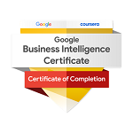

# Google Business Intelligence Professional Certificate

- [Google Business Intelligence Professional Certificate](https://www.coursera.org/professional-certificates/google-business-intelligence)

### SKILLS YOU WILL GAIN:
- Business Intelligence
- Extraction, Transformation And Loading (ETL)
- Bigquery
- Dashboarding and Reporting
- Data Analysis
- Data Modeling
- Business Analysis
- SQL
- Tableau Software
- Business Process
- Sheets
- Data Visualization (DataViz)

## About this Professional Certificate:
Get professional training designed by Google and take the next step in your career with advanced skills in the high-growth field of business intelligence. There are over 166,000 open jobs in business intelligence and the median salary for entry-level roles is $96,000.

Business intelligence professionals collect, organize, interpret, and report on data to help organizations make informed business decisions. Some responsibilities include measuring performance, tracking revenue or spending, and monitoring progress.

This certificate builds on your data analytics skills and experience to take your career to the next level. It's designed for graduates of the 
Google Data Analytics Certificate
 or people with equivalent data analytics experience. Expand your knowledge with practical, hands-on projects, featuring BigQuery, SQL, and Tableau.

After three courses, you’ll be prepared for jobs like business intelligence analyst, business intelligence engineer, business intelligence developer, and more. At under 10 hours a week, the certificate program can be completed in less than two months. Upon completion, you can apply for jobs with Google and over 150 U.S. employers, including Deloitte, Target, and Verizon.

## Applied Learning Project:
This program includes over 70 hours of instruction and 50+ practice-based assessments, which will help you simulate real-world business intelligence scenarios that are critical for success in the workplace. The content is highly interactive and exclusively developed by Google employees with decades of experience in business intelligence. Through a mix of videos, assessments, and hands-on labs, you’ll get introduced to BI tools and platforms and key technical skills required for an entry-level job.

Platforms and tools you will learn include: BigQuery, SQL, Tableau

In addition to expert training and hands-on projects, you'll complete a portfolio project that you can share with potential employers to showcase your new skill set. Learn concrete skills that top employers are hiring for right now.

### 3 Course Series:

  
Foundations of Business Intelligence

  <h6 align="left">
This is the first of three courses in the Google Business Intelligence Certificate, which will help develop the skills needed to apply for entry-level roles as a business intelligence (BI) professional. People who work in BI help organizations access the right data, use data to help businesses grow and improve, and put insights into action. In this course, you’ll discover the role of BI professionals within an organization and explore BI tools you can use on the job. 

Google employees who currently work in BI will guide you through this course by providing hands-on activities that simulate job tasks, sharing examples from their day-to-day work, and helping you build business intelligence skills to prepare for a career in the field. 

Learners who complete the three courses in this certificate program will have the skills needed to apply for business intelligence jobs. This certificate program assumes prior knowledge of foundational analytical principles, skills, and tools covered in the Google Data Analytics Certificate.  

By the end of this course, you will:
- Make key distinctions between business intelligence (BI) and data analysis
- Explore how data is used in business processes and decision-making 
- Describe ways that BI professionals impact their organizations
- Identify the uses and benefits of BI tools, including data models, pipelines, data visualizations, and dashboards
- Acquire, manipulate, and integrate data using key BI concepts
- Select and define metrics that are relevant to project goals and stakeholder questions
- Develop and execute a BI project by working with stakeholders to determine project requirements, execute tasks, and deliver insights that guide decision-making

</h6>

  
The Path to Insights: Data Models and Pipelines

<h6 align="left">
This is the second of three courses in the Google Business Intelligence Certificate. In this course, you'll explore data modeling and how databases are designed. Then you’ll learn about extract, transform, load (ETL) processes that extract data from source systems, transform it into formats that enable analysis, and drive business processes and goals.

Google employees who currently work in BI will guide you through this course by providing hands-on activities that simulate job tasks, sharing examples from their day-to-day work, and helping you build business intelligence skills to prepare for a career in the field. 

Learners who complete the three courses in this certificate program will have the skills needed to apply for business intelligence jobs. This certificate program assumes prior knowledge of foundational analytical principles, skills, and tools covered in the Google Data Analytics Certificate.   

By the end of this course, you will:
- Determine which data models are appropriate for different business requirements
- Describe the difference between creating and interacting with a data model
- Create data models to address different types of questions 
- Explain the parts of the extract, transform, load (ETL) process and tools used in ETL
- Understand extraction processes and tools for different data storage systems
- Design an ETL process that meets organizational and stakeholder needs 
- Design data pipelines to automate BI processes
</h6>

  
Decisions, Decisions: Dashboards and Reports

<h6 align="left">
You’re almost there! This is the third and final course in the Google Business Intelligence Certificate. In this course, you’ll apply your understanding of stakeholder needs, plan and create BI visuals, and design reporting tools, including dashboards. You’ll also explore how to answer business questions with flexible and interactive dashboards that can monitor data over long periods of time.

Google employees who currently work in BI will guide you through this course by providing hands-on activities that simulate job tasks, sharing examples from their day-to-day work, and helping you build business intelligence skills to prepare for a career in the field. 

Learners who complete the three courses in this certificate program will have the skills needed to apply for business intelligence jobs. This certificate program assumes prior knowledge of foundational analytical principles, skills, and tools covered in the Google Data Analytics Certificate.  

By the end of this course, you will:
- Explain how BI visualizations answer business questions
- Identify complications that may arise during the creation of BI visualizations
- Produce charts that represent BI data monitored over time
- Use dashboard and reporting tools
- Build dashboards using best practices to meet stakeholder needs
- Iterate on a dashboard to meet changing project requirements
- Design BI presentations to share insights with stakeholders
- Create or update a resume and prepare for BI interviews
</h6>

## Certificate:

